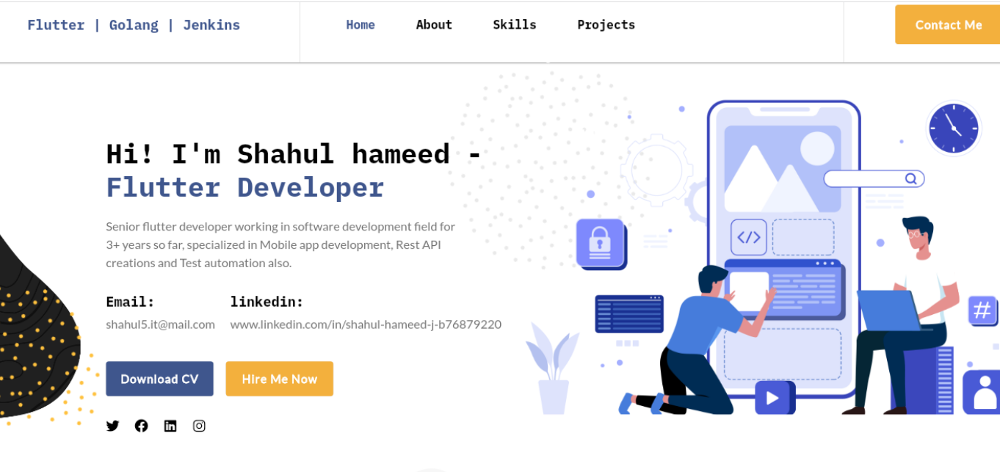
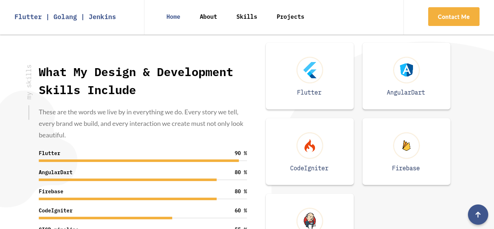

# portfolio

<h1 align="center">
  <a href="https://david-legend.github.io/nimbus/" target="_blank">https://github.com/shahul-hamed/my_portfolio/</a>
</h1>

    This is (Portfolio & CV), a beautifully designed portfolio website built with <strong>flutter</strong>.

    It is inspired by <a href="https://www.behance.net/gallery/96275519/Nimbus-CV-Portfolio-WordPress-Theme" target="_blank">Web Genius Lab Designs on Behance</a>

  

